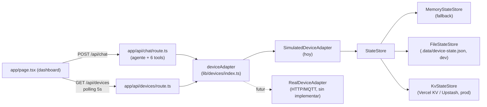

# 🤖 IoT Orchestrator | Zero to Agent Hackathon

Centro de Comando IoT - Un agente de IA orquestador capaz de gestionar un laboratorio automatizado, monitorear telemetría en tiempo real, controlar relés de energía y ejecutar rutinas complejas.

## 🚀 Features

- **📡 Telemetría coherente:** Simulación de sensores ESP32, hubs Raspberry Pi e impresoras 3D con estado persistente — no saltos random, un dispositivo apagado deja de inventar lecturas.
- **⚡ Control de Energía:** Gestión de módulos de relés para encender/apagar equipos del laboratorio.
- **🔄 Rutinas Automatizadas:** Macros complejos como "Preparar Área de Trabajo", "Modo Ahorro de Energía", "Calibración de Sensores" y "Modo Emergencia".
- **📋 Inventario y estado del sistema:** El agente puede listar dispositivos, consultar un resumen general del laboratorio y su historial de eventos/alertas.
- **📊 Dashboard en vivo:** Panel "Sistema" con polling cada 5s (online/offline, consumo estimado, eventos recientes).
- **🌐 UI Interactiva:** Dashboard tipo panel industrial con chat streaming, responsive en mobile y desktop.
- **🛡️ Seguridad:** Headers de seguridad (CSP, X-Frame-Options), sanitización de errores y validación de inputs. Ninguna tool lanza excepciones hacia el agente — siempre devuelven un error estructurado.

## 🛠️ Tech Stack

- **Framework:** Next.js 16 (App Router)
- **IA SDK:** Vercel AI SDK v6 (`ai`, `@ai-sdk/react`, `@ai-sdk/google`)
- **Modelo:** Google Gemini 2.5 Flash Lite
- **Estilos:** Tailwind CSS 4
- **Lenguaje:** TypeScript (`strict`, sin `any`)
- **Tests:** Vitest
- **Persistencia:** archivo local en dev / Vercel KV en producción (ver abajo)
- **Deploy:** Vercel + GitHub CI/CD

## 🏗️ Arquitectura

El agente ("el cerebro") nunca genera datos random ni toca estado directamente.
Todo pasa por una interfaz `DeviceAdapter` ("el cuerpo"), lo que permite conectar
hardware real en el futuro sin reescribir ni una tool.



Ver **[`lib/devices/README.md`](lib/devices/README.md)** para el contrato completo
de la interfaz, cómo se elige el `StateStore`, y la guía paso a paso para
implementar `RealDeviceAdapter` contra hardware real (HTTP o MQTT).

### Persistencia de estado

`resolveStateStore()` elige en cascada, sin que el usuario tenga que
provisionar nada para correr el proyecto:

1. **Vercel KV / Upstash for Redis** (si `KV_REST_API_URL` y `KV_REST_API_TOKEN`
   están seteadas) — sobrevive a cold starts y escala entre instancias.
   > `@vercel/kv` está deprecado por Vercel a favor de instalar directamente una
   > integración "Redis" del Marketplace, pero sigue funcionando contra las
   > mismas variables `KV_REST_API_URL`/`KV_REST_API_TOKEN` — es lo que usa
   > este proyecto. Si en el futuro se retira el paquete, la alternativa
   > directa es `@upstash/redis` contra el mismo REST API.
2. **Archivo local** (`.data/device-state.json`, gitignored) — si no hay KV
   configurado y no es producción. Persiste entre mensajes del chat mientras
   el `next dev` esté corriendo.
3. **Memoria del proceso** — último recurso en producción sin KV. Coherente
   mientras el proceso siga caliente, se resetea en cada cold start (igual
   que el comportamiento anterior de este proyecto).

## 📋 Prerequisites

- Node.js 18+
- Google AI API Key ([Generative AI API Key](https://aistudio.google.com/app/apikey))
- (Opcional) Un store de Vercel KV / Upstash for Redis, si quieres que el
  estado sobreviva a cold starts en producción — ver `.env.example`.

## 🏁 Local Development

1. **Clona el repositorio:**
   ```bash
   git clone https://github.com/mafermugica/Iot_orchestrator.git
   cd Iot_orchestrator
   ```

2. **Instala dependencias:**
   ```bash
   npm install
   ```

3. **Configura variables de entorno:**
   Copia `.env.example` a `.env.local` y agrega tu API Key (las de KV son opcionales):
   ```bash
   cp .env.example .env.local
   ```
   ```env
   GOOGLE_GENERATIVE_AI_API_KEY=your_api_key_here
   ```

4. **Inicia el servidor de desarrollo:**
   ```bash
   npm run dev
   ```
   Accede en tu navegador: [http://localhost:3000](http://localhost:3000)
   O desde otro dispositivo en tu red local: `http://[TU-IP-LOCAL]:3000`

5. **Corre los tests:**
   ```bash
   npm run test
   ```

## ☁️ Deploy en Vercel

La forma más rápida es usar el dashboard de Vercel:

1. Ve a [vercel.com/new](https://vercel.com/new)
2. Importa tu repositorio de GitHub: `mafermugica/Iot_orchestrator`
3. En **Environment Variables**, agrega:
   - **Key:** `GOOGLE_GENERATIVE_AI_API_KEY`
   - **Value:** Tu clave de Google AI Studio (empieza con `AIzaSy...`)
4. (Opcional, recomendado para producción) Conecta una integración de Redis
   desde el Marketplace de Vercel — agrega automáticamente
   `KV_REST_API_URL`/`KV_REST_API_TOKEN`, y el estado de los dispositivos
   sobrevive a cold starts.
5. Click en **Deploy**

Vercel configurará automáticamente el CI/CD. Cada `git push` a `main` desencadenará un nuevo despliegue.

## 🧠 Herramientas del Agente (Tools)

| Tool | Descripción | Parámetros |
|------|-------------|------------|
| `getDeviceTelemetry` | Telemetría en tiempo real de un dispositivo (coherente con su historial). | `deviceId` |
| `toggleRelayPower` | Enciende/apaga el relé de un nodo. | `targetNode`, `state` (`on`/`off`) |
| `executeAutomationRoutine` | Ejecuta una rutina multi-dispositivo. | `routineName` |
| `scheduleTask` | Programa una rutina para más adelante (mock, sin cron real). | `routineName`, `delayMinutes` |
| `listDevices` | Lista todos los dispositivos y su estado actual. | — |
| `getSystemStatus` | Resumen del laboratorio: online/offline, alertas, consumo estimado. | — |
| `getRecentEvents` | Historial de eventos (cambios de estado, alertas, calibraciones). | `limit` (opcional) |

### Rutinas de automatización

- **"Preparar Área de Trabajo"** — enciende iluminación, ventilación y equipos.
- **"Modo Ahorro de Energía"** — apaga iluminación y equipos no esenciales.
- **"Calibración de Sensores"** — marca el ESP32 como "calibrando" ~12s y luego "calibrado".
- **"Modo Emergencia"** — corta todos los relés no críticos y genera un evento crítico visible en el dashboard.

## 📁 Project Structure

```
├── app/
│   ├── api/chat/route.ts    # Backend: agente IA con 7 tools
│   ├── api/devices/route.ts # Endpoint de solo lectura para el dashboard (polling)
│   ├── layout.tsx           # Layout global con metadata
│   ├── page.tsx             # Frontend: Dashboard de chat + panel "Sistema"
│   └── globals.css          # Estilos Tailwind + tema oscuro
├── lib/devices/
│   ├── types.ts             # Interfaz DeviceAdapter y tipos compartidos
│   ├── stateStore.ts        # Memory / File / Kv — persistencia intercambiable
│   ├── simulated.ts         # SimulatedDeviceAdapter (implementado)
│   ├── real.stub.ts         # Esqueleto de RealDeviceAdapter (HTTP/MQTT, futuro)
│   ├── index.ts             # Único punto de export: deviceAdapter
│   ├── README.md            # Arquitectura + guía de hardware real
│   └── *.test.ts            # Tests (Vitest)
├── .env.example              # Variables de entorno documentadas
├── .data/                    # Estado del FileStateStore en dev (gitignored)
├── next.config.ts           # Configuración de Next.js + Security Headers
└── package.json             # Dependencias y scripts
```

## 📄 License

MIT License - ver [LICENSE](LICENSE) para más detalles.

---
Creado para el **Vercel Zero to Agent Hackathon** 🚀
